# Distribution Computation Problem (HW-3)
### Description: The goal of this homework is for students to gain experience with solving a distributed computational problem using cloud computing technologies by designing and implementing a RESTful service and a lambda function that are accessed from clients using gRPC.
( CS441 | Fall 2021 )
## Name: Samihan Nandedkar
### UIN: 667140409

Please find below the video explaining the execution and deployment for project:

### Running the project.

Steps to run the project.
1. Clone the repository in your local system. 
2. Download and install all the required prerequisites,
   1. Java Development Kit
   2. sbt
3. Navigate the repository's root directory in terminal/command prompt. 
4. Run the following command to install all the required packages mentioned in build.sbt.
```
sbt clean compile
```
5. Once compiled please execute following command to start the execution of project.
```
sbt clean run
```
6. The project contains two implementations. 
   1. Rest: 
      * To run the rest implementations, please choose option to execute `SearchRestClient`
      * Then enter the required option of running the POST request or GET request and press enter. 
   2. gRPC:
      * To run the gRPC implementation, first choose option to execute `SearchGrpcServer` to start the server.
      * Open another terminal, run the same command and choose option to start the execution `SearchGrpcClient` to start the execution of client. 

---
**Note**

If your local system is a M1 Macbook, some errors might arise while compilation of the project due to ScalaPB project. 
Example of error can be seen in the image below. 
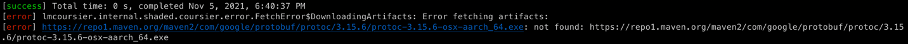

This is due to the support for M1 ARM based chips are not added to ScalaPB yet. 

To resolve the issue please follow the steps given below. 
* Install protobuf package using Homebrew. Please run the following command. 
```
brew install protobuf
```
* After installation, please uncomment the following line in [build.sbt](build.sbt)
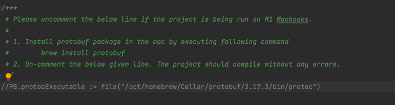 
* The project should compile successfully now.

Reference: https://github.com/scalapb/ScalaPB/issues/1024

---

### Project Structure
This project can be divided into 4 major parts. 
1. Setup LogFileGenerator in a EC2 instance and update the log files in S3 bucket periodically.
2. Create a AWS Lambda function to perform the task of searching for logs message in given time frame. 
3. Invoking the Lambda Function through API Gateway using POST/GET method.
4. Create a client-server model to trigger the AWS Lambda function though gRPC framework.

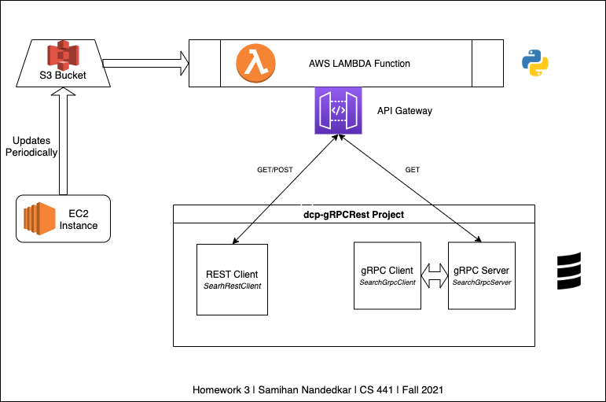

The above diagram shows all the parts and how they interact with each other. 
## Part 1: LogFileGenerator in EC2 Instance. 

### Updating LogFileGenerator code
Updated Forked repository: https://github.com/samihann/LogFileGenerator

The LogFileGenerator should be periodically running in EC2 instance at designated time and keep on appending the logs
to messages a single log file. And the updated log file should be placed in S3 bucket from where the Lambda Function can access it. 

* To achieve this functionality there are few changes made to LogFileGenerator logback.xml file. Updated code can be accessed in the 
forked repository mentioned above. 


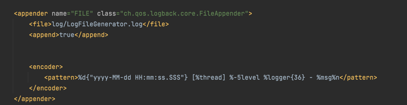


* The files will be updated to a single file named `LogFileGenerator.log`, and each log message will have datetime stamp in the following format. 
```
2021-10-31 23:34:50.208 [main] INFO  GenerateLogData$ - Log data generator started...
```
### Create EC2 Instance & setup environment
* Generated a EC2 instance with Amazon Linux image and installed all the required packages in the instance. 

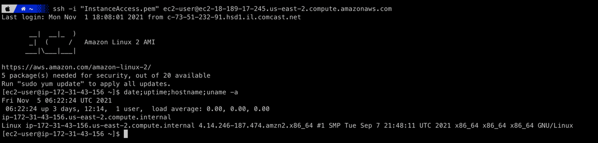

* Set up the LogFileGenerator project in the instance to be run using sbt.
* Create and attach a IAM role to EC2 instance to provide S3 access. 
### Cron
* To run the project periodically in the linux instance, Cron is utilized. 
* All the terminal commands required to run the application are put in a shell script.
* At the designated time, the cron will execute the shell script and run the application. 

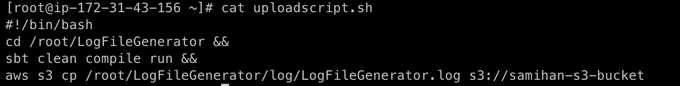

* Please refer file to see the shell script. 
* AWS CLI is used to copy the updated log file to S3 bucket where the lambda function can access it. 
* Please refer below to see the crontab entry.

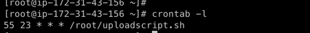

* At 23:55 each day, the [uploadscript.sh](/docs/uploadscript.sh) will be executed which will add logs messages to LogGenerator.log file.

## Part 2: AWS Lambda

### Code

File: [LambdaFunction.py](/docs/LambdaFunction.py)

* The program is written in Python. 
* It is taking time, deltaTime & pattern as input and returns if the pattern is present in the time frame.
* The response will be returned with appropriate status code. 

The code is using binary search to locate the given time in the log file making the time complexity of code as O(log(n))

## API Gateway

* To trigger the Lambda function, it is connected with API Gateway with GET and POST method defined. 


* Whenever a GET/POST request is made to the created API gateway, Lambda function will be triggered taking the query parameters/payload as input.
* The POST request can also be made through Postman as it can seen below with payload in following format. 
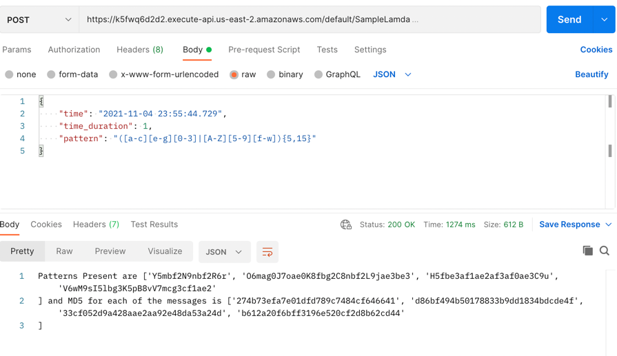
* Similarly, the GET request can also be made by passing the values through query parameters. 
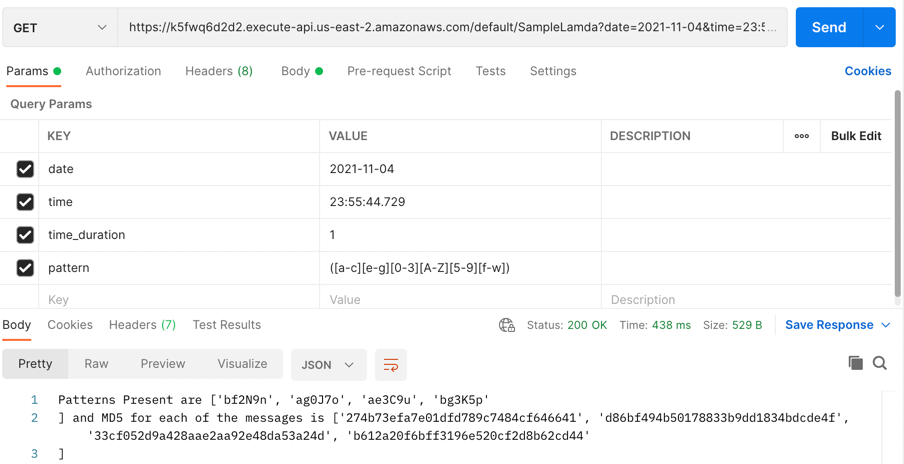
## Part 3: POST/GET Request Client. 

Package: _com.samihann.rest_

Packages used to make calls: Apache HTTP

* `SearchRestClient` contains the client function to make POST and GET request to lambda function.

### Simulation:

* To run the application, please navigate to project root directory and run the following command to run the project. 
```
sbt clean compile run
```
* Please run `SearchRestClient`, which will provide user with option to make POST/GET request. 
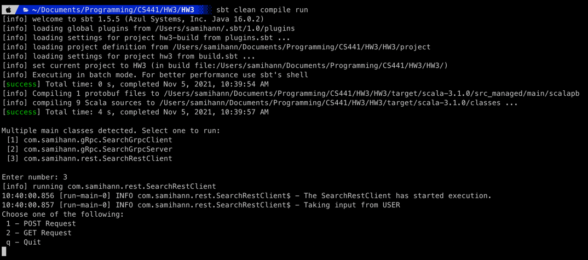
* Please select the required option to start the simulation adn see the output. 

### Output

Run the project using below given command and select option 3 to execute `SearchRestClient`.

  ```
  sbt clean compile run
  ``` 

#### Post Request
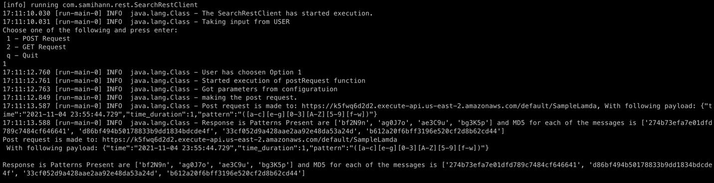
The Post request is made to the AWS Lambda function with the following payload to receive the response with the pattern present. 

#### Get Request 
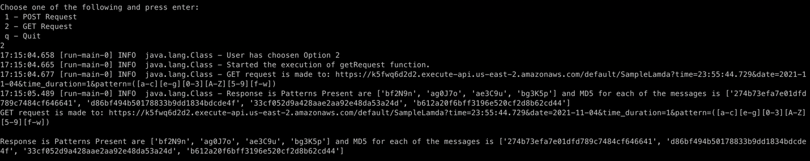
The Get request is made to AWS Lambda function with by passing values through query parameters. 

## Part 4: gRPC Client/Server

Package: com.samihann.rest

* `LogSearch.proto` file located in /src/main/protobuf contains the structure for a protobuf to be used for gRPC request. 
[LogSearch.proto](/src/main/protobuf/LogSearch.proto)
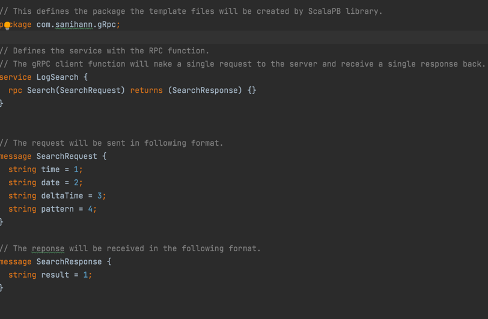
* ScalaPB package will use the .proto file to create the stubs which can be used to create gRPC Client/Server and facilitate the interaction between them. 
Files will be created in /target/scala***/src_managed/main/scalapb/<package-name>/
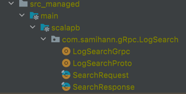

* Using these files, Server and Client is created to be run locally. 
* Server will receive the RPC call from client will make a GET request to lambda function and return the response to client. 

### Output
Please run the project by running below given command in the root directory. 

  ```
  sbt clean compile run
  ``` 
    
**Please start the execution of `SearchGrpcServer` first and then open another terminal and run the `SearchGrpcClient`.**

#### Server

The server will start running on localhost and will be listening on port 8980.
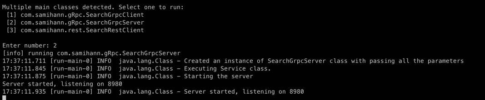

The server will call `SearchGrpcService`, which had the function(Search) which is being requested to be executed through RPC.
 * The Server will receive request in `SearchRequest` class format and will revert ann instance of `SearchResponse`


#### Client

The server will send a RPC request to running server and wait for respose.

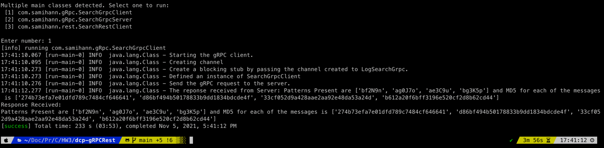

As the Client function is using a **blocking stub** the function will wait till it receives response from server and then terminate. 


### Test Cases

* Through Command Line
  * Clone the following repository in your system.
  * On command line please navigate to the following repository. And run the following commands to compile and run the test cases.
  
  ```
  sbt clean compile test
  ``` 

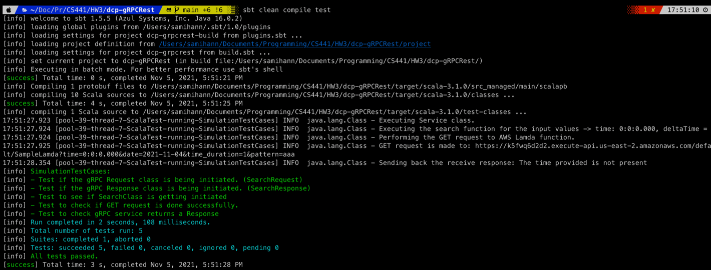


### References

* https://github.com/0x1DOCD00D/LogFileGenerator
* https://www.cloudera.com/
* https://aws.amazon.com/education/awseducate/


